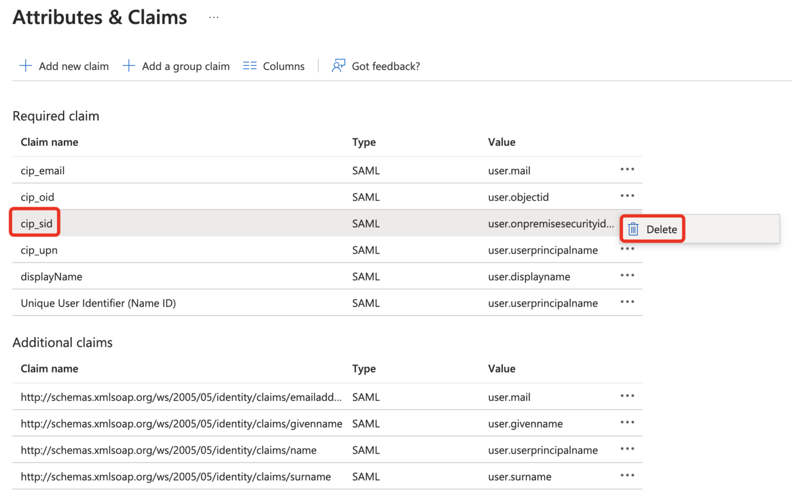

## Intro
I had a customer senario where the the users where authenticated from another Entra teant/Forest and needed to match their identity to a shadow account

Start by following the standard configuration of SAML2.0 in Citrix Cloud by Citrix
The only requirement is that objcectGUID is synced

When you get to the Attributes & Claims, delete the SID part

Depending on if you want to match SID or UPN delete the other from the Citrix Cloud SAML 2.0 Configuration
