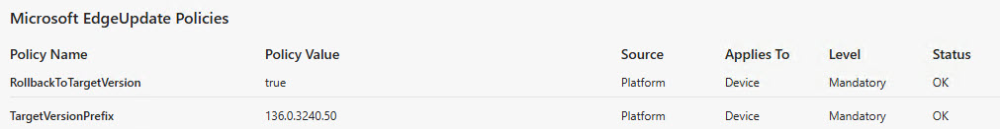

Today I had to debug a problem with a customer who has published Microsoft Edge via Citrix for secure access to T0 management
and after updateing to the latest version of Edge, the users were unable to download a `.rdp` file from this web application.

We had a quick chat with some Microsoft engineers and they suggested to rollback to a previous version of Edge, which is possible with the `RollbackToTargetVersion` policy.
I had no idea that this was possible, but it is a great feature for testing and debugging purposes.


```
HKEY_LOCAL_MACHINE\SOFTWARE\Policies\Microsoft\EdgeUpdate
```

Value Name: `RollbackToTargetVersion{56EB18F8-B008-4CBD-B6D2-8C97FE7E9062}`\
Value Type: `REG_DWORD`\
Value Data: `1`\

```
HKEY_LOCAL_MACHINE\SOFTWARE\Policies\Microsoft\EdgeUpdate
```

Value Name: `TargetVersionPrefix{56EB18F8-B008-4CBD-B6D2-8C97FE7E9062}`\
Value Type: `REG_SZ`\
Value Data: `136.0.3240.50`\

Confirm with in Edge, on page `edge://policy` that the policy is applied.



Now go to `edge://settings/help` and you will see that the version is been downloaded and will be rolled back to the specified version when you restart the browser.

Ohh and what is with the GUID in the policy name?
That is the Application GUID for Microsoft Edge Stable Channel. Microsoft uses GUIDs to distinguish between Edge update channels:
- `Stable Channel`: `{56EB18F8-B008-4CBD-B6D2-8C97FE7E9062}`
- `Beta Channel`: `{2CD8A007-E189-409D-A2C8-9AF4EF3C72AA}`
- `Dev Channel`: `{0D50BFEC-CD6A-4F9A-964C-C7416E3ACB10}`
- `Canary Channel`: `{4ea16ac7-fd5a-47c3-875b-dbf4a2008c20}`